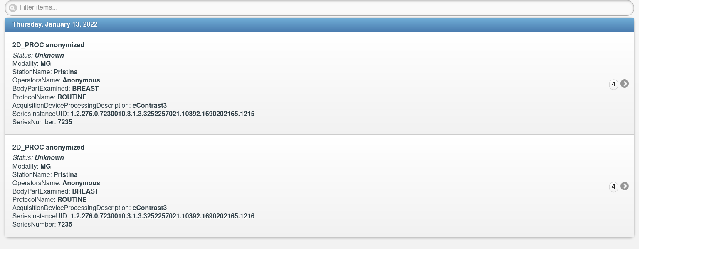

# DICOM Query/Retrieve приложение
Разработать консольное приложение, выполняющее следующие операции:
1. Выполняет C-FIND запрос к PACS по модальности MG, получая список всех исследований в этой модальности
2. Получает от PACS медицинские изображения первой попавшейся серии в первом попавшемся исследовании из списка п.1
3. Создаёт новую серию, содержащую медицинские изображения, повторяющие полученные из PACS, но повернутые на 90 градусов
4. Загружает новую серию в исходное исследование в PACS

В качестве тестового PACS можно использовать контейнеризованный orthanc (osimis/orthanc или jodogne/orthanc).

### Версии библиотек:
- pydicom==2.4.3
- pynetdicom==2.0.2 

## Установка
Для начала скопируйте репозиторий и перейдите в папку с проектом:
```
git clone https://github.com/Jericho-kd/dicom-test.git
cd dicom-test
```
Если у вас установлен poetry, то введите следующие команды для установки всех зависимостей проекта и создания и активации виртуального окружения:
```
poetry install
poetry shell
``` 

Если у вас не установлен poetry, то создайте новое виртуальное окружение с помощью команды:
```
python3 -m venv dicom-env
``` 
Активируйте виртуальное окружение и установите все зависимости с помощью команд:
```
source dicom-env/bin/activate
pip install -r requirements.txt
``` 

## Подготовка к запуску
Исправления в файлах:
- В файле orthanc.json в секции **DicomEntities** исправьте ip-адрес для SCP_STORAGE на адрес, который находится в одной подсети с docker-контейнером (в моем случае это 172.18.0.1).
- В файле example.env в поле **STORAGE_IP = 'your_ip'** задайте ip-адрес из предыдущего шага.
- В файле example.env в поле **OUTPUT_DIR = 'path/to/save/images'** задайте путь, по которому будут сохраняться изображения, скачанные с PACS.
- Переименуйте example.env в .env для корректной работы config.py.

Для развертывания docker-контейнера orthanc запустите следующую команду:
```
docker compose up -d
```

По окончании развертывания контейнера перейдите по ссылке http://localhost:8042/
- Логин: orthanc
- Пароль: orthanc

**Не забудьте загрузить файлы исследования!**

## Использование


Перейдите в папку с файлами проекта и запустите SCP STORAGE, который будет принимать команду C-STORE:
```
cd dicom_test
python3 scp_storage.py
```

В новом окне терминала запустите следующую команду:
```
python3 main.py
```
По выполнении данной команды проверьте ваш PACS. \
У вас должно появиться новое исследование с повернутыми на 90 градусов изображениями


